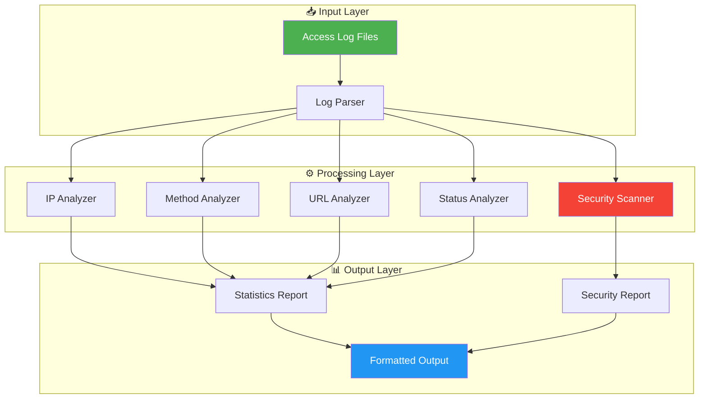

<div align="center">

# 🔍 Perl Log Analyzer

### Professional-Grade Access Log Analysis with Security Intelligence

[](https://www.perl.org/)
[](LICENSE)
[](#testing)
[](http://makeapullrequest.com)
[](https://perltidy.sourceforge.net/)

---

**A powerful, fast, and security-focused tool for analyzing Apache/nginx access logs**

*Detect threats • Analyze patterns • Generate reports*

---

</div>

## 📋 Table of Contents

- [✨ Features](#-features)
- [🏗️ Architecture](#️-architecture)
- [📁 Project Structure](#-project-structure)
- [⚡ Quick Start](#-quick-start)
- [📖 Usage Guide](#-usage-guide)
- [🔧 Configuration](#-configuration)
- [🛡️ Security Detection](#️-security-detection)
- [📊 Sample Output](#-sample-output)
- [📈 Performance](#-performance)
- [🧪 Testing](#-testing)
- [🤝 Contributing](#-contributing)
- [📄 License](#-license)

---

## ✨ Features

<table>
<tr>
<td width="50%">

### 🔧 **Log Generator**

- ✅ Generate 100 to 100,000+ entries
- ✅ Realistic IP addresses (internal & public)
- ✅ Diverse HTTP methods (GET, POST, PUT, DELETE)
- ✅ Weighted status code distribution
- ✅ Multiple User-Agent strings
- ✅ Configurable time ranges

</td>
<td width="50%">

### 📊 **Log Analyzer**

- ✅ Top IP addresses by request count
- ✅ HTTP method distribution
- ✅ Response code breakdown (2xx-5xx)
- ✅ High error rate detection
- ✅ Security threat identification
- ✅ User-Agent statistics

</td>
</tr>
</table>

---

## 🏗️ Architecture



### Data Flow

```
┌─────────────────────────────────────────────────────────────────────────────┐
│                           LOG ANALYSIS PIPELINE                              │
├─────────────────────────────────────────────────────────────────────────────┤
│                                                                              │
│   ┌──────────┐    ┌──────────┐    ┌──────────┐    ┌──────────┐             │
│   │   LOG    │───▶│  PARSE   │───▶│ ANALYZE  │───▶│  REPORT  │             │
│   │   FILE   │    │  REGEX   │    │  STATS   │    │  OUTPUT  │             │
│   └──────────┘    └──────────┘    └──────────┘    └──────────┘             │
│        │               │               │               │                     │
│        ▼               ▼               ▼               ▼                     │
│   ┌──────────┐    ┌──────────┐    ┌──────────┐    ┌──────────┐             │
│   │  Lines   │    │  Fields  │    │   Hash   │    │  String  │             │
│   │  Count   │    │  Extract │    │  Tables  │    │  Format  │             │
│   └──────────┘    └──────────┘    └──────────┘    └──────────┘             │
│                                                                              │
└─────────────────────────────────────────────────────────────────────────────┘
```

---

## 📁 Project Structure

```
Perl_anlz/
│
├── 📂 bin/                          # Executable scripts
│   ├── 🔍 log_analyzer             # Main analysis tool
│   └── 🔧 generate_logs            # Test data generator
│
├── 📂 lib/                          # Perl modules
│   └── 📂 Perl/
│       └── 📂 Log/
│           ├── 📦 Analyzer.pm       # Main module (entry point)
│           └── 📂 Analyzer/
│               ├── 🔍 Parser.pm     # Log parsing engine
│               └── 📊 Reporter.pm   # Report generation
│
├── 📂 t/                            # Test suite
│   ├── 01-parser.t                  # Parser unit tests
│   ├── 02-reporter.t                # Reporter unit tests
│   └── 03-analyzer.t                # Integration tests
│
├── 📂 app/                          # Application resources
│   ├── 📂 sample_logs/              # Sample log files
│   │   ├── 📂 100/                  # 100 entries
│   │   ├── 📂 1000/                 # 1,000 entries
│   │   └── 📂 10000/                # 10,000 entries
│   └── 📦 cpanfile                  # Dependencies
│
├── 📂 results/                      # Sample analysis reports
│   ├── 100_sample_report.txt
│   ├── 1000_sample_report.txt
│   └── 10000_sample_report.txt
│
├── 🔧 Makefile.PL                   # Build configuration
├── 📄 LICENSE                       # MIT License
├── 🔒 .gitignore                    # Git exclusions
└── 📖 README.md                     # This file
```

---

## ⚡ Quick Start

### 1️⃣ Clone & Install

```bash
# Clone the repository
git clone https://github.com/qqwozz/Perl_anlz.git
cd Perl_anlz

# Install dependencies
cpanm --installdeps .
```

### 2️⃣ Generate Test Data

```bash
# Generate 1,000 log entries (default)
./bin/generate_logs

# Generate 10,000 entries for stress testing
./bin/generate_logs --count=10000 --output=large_test.log
```

### 3️⃣ Analyze Logs

```bash
# Basic analysis
./bin/log_analyzer access.log

# Detailed analysis with custom settings
./bin/log_analyzer --top=20 --error-threshold=30 access.log

# Export to file
./bin/log_analyzer access.log > report.txt
```

---

## 📖 Usage Guide

### 🔍 Log Analyzer

```bash
./bin/log_analyzer [OPTIONS] <LOG_FILE>
```

| Option | Description | Default |
|--------|-------------|---------|
| `--top=N` | Number of top items to display | `10` |
| `--suspicious-threshold=N` | Suspicious IP detection threshold | `100` |
| `--error-threshold=N` | High error rate threshold | `50` |
| `--help` | Show help message | - |
| `--man` | Show full documentation | - |

**Examples:**

```bash
# Analyze with top 20 IPs displayed
./bin/log_analyzer --top=20 access.log

# Custom thresholds for security analysis
./bin/log_analyzer --suspicious-threshold=50 --error-threshold=25 access.log

# Pipe to file
./bin/log_analyzer access.log > detailed_report.txt
```

### 🔧 Log Generator

```bash
./bin/generate_logs [OPTIONS]
```

| Option | Description | Default |
|--------|-------------|---------|
| `--output, -o=FILE` | Output file path | `access.log` |
| `--count, -c=N` | Number of entries to generate | `1000` |
| `--help, -h` | Show help message | - |
| `--man, -m` | Show full documentation | - |

**Examples:**

```bash
# Generate 5,000 entries to custom file
./bin/generate_logs --output=test.log --count=5000

# Generate minimal test data
./bin/generate_logs --count=100 --output=small_test.log
```

---

## 🔧 Configuration

### Log Format Support

The analyzer supports the **Extended Log Format** (Common Log Format):

```
%h %l %u %t "%r" %>s %b "%{Referer}i" "%{User-Agent}i"
```

| Field | Description | Example |
|-------|-------------|---------|
| `%h` | Client IP address | `192.168.1.1` |
| `%l` | Remote logname | `-` |
| `%u` | Authenticated user | `-` |
| `%t` | Timestamp | `[10/Jan/2024:12:00:00 +0000]` |
| `%r` | Request line | `GET /index.html HTTP/1.1` |
| `%s` | Status code | `200` |
| `%b` | Response size | `1234` |
| `%{Referer}i` | Referer header | `-` |
| `%{User-Agent}i` | User-Agent string | `Mozilla/5.0...` |

### Example Log Entry

```
192.168.1.1 - - [10/Jan/2024:12:00:00 +0000] "GET /index.html HTTP/1.1" 200 1234 "-" "Mozilla/5.0 (Windows NT 10.0; Win64; x64) Chrome/120.0.0.0"
```

---

## 🛡️ Security Detection

The analyzer includes a comprehensive security module that detects:

<table>
<tr>
<td width="50%">

### 🔍 **Attack Patterns**

- Path Traversal (`../`, `..%5c`)
- SQL Injection (`UNION SELECT`)
- XSS Attempts (`<script>`, `javascript:`)
- Command Injection (`;ls`, `|cat`)
- WordPress Exploits (`wp-admin`)
- Database Access (`phpmyadmin`)

</td>
<td width="50%">

### 🤖 **Suspicious Clients**

- Security Scanners (Nikto, Nmap, SQLMap)
- Automated Bots (wget, curl, python-requests)
- Vulnerability Scanners (Nessus, Acunetix)
- Mass Scanners (Masscan, Zgrab)

</td>
</tr>
</table>

### Threat Detection Flow

```
┌─────────────────────────────────────────────────────────────────┐
│                     SECURITY ANALYSIS ENGINE                     │
├─────────────────────────────────────────────────────────────────┤
│                                                                  │
│   ┌─────────────┐                                               │
│   │  LOG ENTRY  │                                               │
│   └──────┬──────┘                                               │
│          │                                                       │
│          ▼                                                       │
│   ┌─────────────┐    ┌─────────────┐    ┌─────────────┐         │
│   │ URL Pattern │    │ User Agent  │    │ IP Behavior │         │
│   │   Check     │    │   Check     │    │   Check     │         │
│   └──────┬──────┘    └──────┬──────┘    └──────┬──────┘         │
│          │                  │                  │                 │
│          ▼                  ▼                  ▼                 │
│   ┌─────────────────────────────────────────────────────┐       │
│   │              THREAT CLASSIFICATION                  │       │
│   │  • High Risk    • Medium Risk    • Low Risk        │       │
│   └─────────────────────────────────────────────────────┘       │
│          │                                                       │
│          ▼                                                       │
│   ┌─────────────┐                                               │
│   │   REPORT    │                                               │
│   │  GENERATION │                                               │
│   └─────────────┘                                               │
│                                                                  │
└─────────────────────────────────────────────────────────────────┘
```

---

## 📊 Sample Output

### General Statistics

```
════════════════════════════════════════════════════════════════════════════════
                          LOG ANALYSIS REPORT
════════════════════════════════════════════════════════════════════════════════

┌────────────────────────────────────────────────────────────────────────────┐
│                         GENERAL STATISTICS                                  │
├────────────────────────────────────────────────────────────────────────────┤
│  Total requests:    10,000                                                 │
│  Unique IPs:        247                                                    │
│  Total data:        48.73 MB                                               │
│  Error rate:        4.2%                                                   │
└────────────────────────────────────────────────────────────────────────────┘

┌────────────────────────────────────────────────────────────────────────────┐
│                    TOP 10 IPs BY REQUEST COUNT                             │
├────────────────────────────────────────────────────────────────────────────┤
│  192.168.1.1     : 1,247 requests (12.5%)  ████████████████░░░░░░         │
│  10.0.0.1        :   892 requests ( 8.9%)  ███████████░░░░░░░░░░░         │
│  172.16.0.1      :   756 requests ( 7.6%)  █████████░░░░░░░░░░░░░         │
│  8.8.8.8         :   534 requests ( 5.3%)  ██████░░░░░░░░░░░░░░░░         │
│  1.1.1.1         :   423 requests ( 4.2%)  █████░░░░░░░░░░░░░░░░░         │
│  203.0.113.50    :   312 requests ( 3.1%)  ████░░░░░░░░░░░░░░░░░░         │
│  198.51.100.25   :   287 requests ( 2.9%)  ███░░░░░░░░░░░░░░░░░░░         │
│  192.168.1.100   :   245 requests ( 2.5%)  ███░░░░░░░░░░░░░░░░░░░         │
│  10.0.0.50       :   198 requests ( 2.0%)  ██░░░░░░░░░░░░░░░░░░░░         │
│  172.16.0.100    :   176 requests ( 1.8%)  ██░░░░░░░░░░░░░░░░░░░░         │
└────────────────────────────────────────────────────────────────────────────┘
```

### HTTP Method Distribution

```
┌────────────────────────────────────────────────────────────────────────────┐
│                    HTTP METHOD DISTRIBUTION                                 │
├────────────────────────────────────────────────────────────────────────────┤
│                                                                            │
│  GET       : 6,847 requests (68.5%)  ████████████████████████████████░░   │
│  POST      : 2,134 requests (21.3%)  ██████████░░░░░░░░░░░░░░░░░░░░░░░   │
│  PUT       :   654 requests ( 6.5%)  ███░░░░░░░░░░░░░░░░░░░░░░░░░░░░░░   │
│  DELETE    :   365 requests ( 3.7%)  █░░░░░░░░░░░░░░░░░░░░░░░░░░░░░░░░   │
│                                                                            │
└────────────────────────────────────────────────────────────────────────────┘
```

### Response Code Analysis

```
┌────────────────────────────────────────────────────────────────────────────┐
│                   RESPONSE CODE DISTRIBUTION                               │
├────────────────────────────────────────────────────────────────────────────┤
│                                                                            │
│  ┌──────────────────────────────────────────────────────────────────────┐  │
│  │  200 OK          ████████████████████████████████████░░░░  8,547    │  │
│  │  301 Redirect    ███░░░░░░░░░░░░░░░░░░░░░░░░░░░░░░░░░░░░    423    │  │
│  │  404 Not Found   █████░░░░░░░░░░░░░░░░░░░░░░░░░░░░░░░░░░    687    │  │
│  │  500 Error       ██░░░░░░░░░░░░░░░░░░░░░░░░░░░░░░░░░░░░░    343    │  │
│  └──────────────────────────────────────────────────────────────────────┘  │
│                                                                            │
└────────────────────────────────────────────────────────────────────────────┘
```

### Security Analysis

```
════════════════════════════════════════════════════════════════════════════════
                         ⚠️  SECURITY ANALYSIS
════════════════════════════════════════════════════════════════════════════════

┌────────────────────────────────────────────────────────────────────────────┐
│                   TOP 10 SUSPICIOUS IPs                                     │
├────────────────────────────────────────────────────────────────────────────┤
│                                                                            │
│  🚨 10.0.0.50       : 47 suspicious requests (23.7%)                      │
│  🚨 198.51.100.99   : 32 suspicious requests (18.4%)                      │
│  ⚠️  203.0.113.77    : 28 suspicious requests (15.2%)                      │
│  ⚠️  192.168.1.200   : 19 suspicious requests (12.8%)                      │
│  ⚠️  172.16.0.50     : 15 suspicious requests ( 9.3%)                      │
│                                                                            │
└────────────────────────────────────────────────────────────────────────────┘

┌────────────────────────────────────────────────────────────────────────────┐
│                   DETECTED THREAT TYPES                                     │
├────────────────────────────────────────────────────────────────────────────┤
│                                                                            │
│  Path Traversal        : 47 attempts  ████████████████████░░░░░░░░░░░░░   │
│  SQL Injection         : 32 attempts  █████████████░░░░░░░░░░░░░░░░░░░░   │
│  WordPress Exploits    : 28 attempts  ███████████░░░░░░░░░░░░░░░░░░░░░░   │
│  XSS Attempts          : 19 attempts  ███████░░░░░░░░░░░░░░░░░░░░░░░░░░   │
│  Database Access       : 15 attempts  ██████░░░░░░░░░░░░░░░░░░░░░░░░░░░   │
│                                                                            │
└────────────────────────────────────────────────────────────────────────────┘
```

---

## 📈 Performance

<table>
<tr>
<td width="50%">

### ⚡ Speed Benchmarks

| Log Size | Entries | Time |
|----------|---------|------|
| 🟢 Small | 100 | < 0.1s |
| 🟡 Medium | 1,000 | < 0.5s |
| 🟠 Large | 10,000 | < 2s |
| 🔴 Very Large | 100,000 | < 10s |

</td>
<td width="50%">

### 💾 Memory Usage

| Log Size | Memory |
|----------|--------|
| 🟢 Small | ~2 MB |
| 🟡 Medium | ~5 MB |
| 🟠 Large | ~15 MB |
| 🔴 Very Large | ~50 MB |

</td>
</tr>
</table>

### Performance Graph

```
Processing Time (seconds)
    │
 10 ┤                                          ●─────── 100K entries
    │                                    ╱
  8 ┤                                  ╱
    │                                ╱
  6 ┤                              ╱
    │                            ╱
  4 ┤                          ╱
    │                        ╱
  2 ┤              ●───────●─────────────────── 10K entries
    │        ╱
  1 ┤  ●───●────────────────────────────────── 1K entries
    │╱
  0 ┼──────┬──────┬──────┬──────┬──────┬──────┬──────
    0    10K    20K    30K    40K    50K    60K   Log Entries
```

---

## 🧪 Testing

### Run Tests

```bash
# Run all tests
prove -l t/

# Run specific test file
prove -l t/01-parser.t

# Verbose output
prove -lv t/

# Run with coverage (requires Devel::Cover)
cover -test
```

### Test Coverage

<table>
<tr>
<td width="50%">

### ✅ Test Results

```
t/01-parser.t ......... ok
t/02-reporter.t ....... ok
t/03-analyzer.t ....... ok
Files=3, Tests=18, 0 wallclock secs
Result: PASS
```

</td>
<td width="50%">

### 📊 Test Categories

| Category | Tests | Status |
|----------|-------|--------|
| Parser | 8 | ✅ |
| Reporter | 5 | ✅ |
| Integration | 5 | ✅ |
| **Total** | **18** | **✅** |

</td>
</tr>
</table>

---

## 🤝 Contributing

We welcome contributions! Please follow these guidelines:

### Development Setup

```bash
# Fork and clone
git clone https://github.com/YOUR_USERNAME/Perl_anlz.git
cd Perl_anlz

# Install development dependencies
cpanm --installdeps .

# Run tests before submitting
prove -l t/
```

### Code Style

- Follow Perl best practices
- Use `perltidy` for formatting
- Add tests for new functionality
- Update documentation as needed

### Pull Request Process

1. 🍴 Fork the repository
2. 🌿 Create feature branch (`git checkout -b feature/amazing-feature`)
3. 💾 Commit changes (`git commit -m 'Add amazing feature'`)
4. 📤 Push to branch (`git push origin feature/amazing-feature`)
5. 📬 Open Pull Request

---

## 📄 License

This project is licensed under the MIT License - see the [LICENSE](LICENSE) file for details.

```
MIT License

Copyright (c) 2024 Perl Log Analyzer

Permission is hereby granted, free of charge, to any person obtaining a copy
of this software and associated documentation files (the "Software"), to deal
in the Software without restriction, including without limitation the rights
to use, copy, modify, merge, publish, distribute, sublicense, and/or sell
copies of the Software...
```

---

## 🙏 Acknowledgments

<table>
<tr>
<td>

### 📚 Resources

- [Apache HTTP Server Logs](https://httpd.apache.org/docs/current/logs.html)
- [Perl Documentation](https://perldoc.perl.org/)
- [CPAN Modules](https://metacpan.org/)

</td>
<td>

### 🛠️ Built With

- **Perl 5.10+** - Core language
- **Getopt::Long** - CLI parsing
- **Test::More** - Testing framework

</td>
</tr>
</table>

---

<div align="center">

### 📊 Project Stats


---

**Built with ❤️ by Perl developers, for DevOps engineers**

[⬆ Back to Top](#-perl-log-analyzer)

</div>
